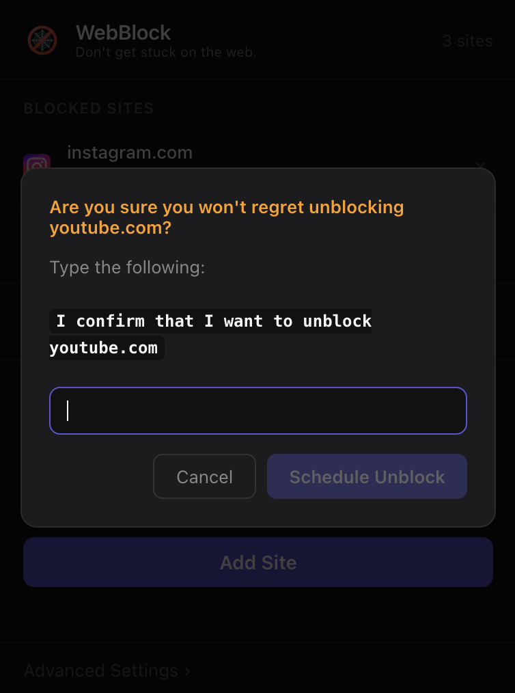
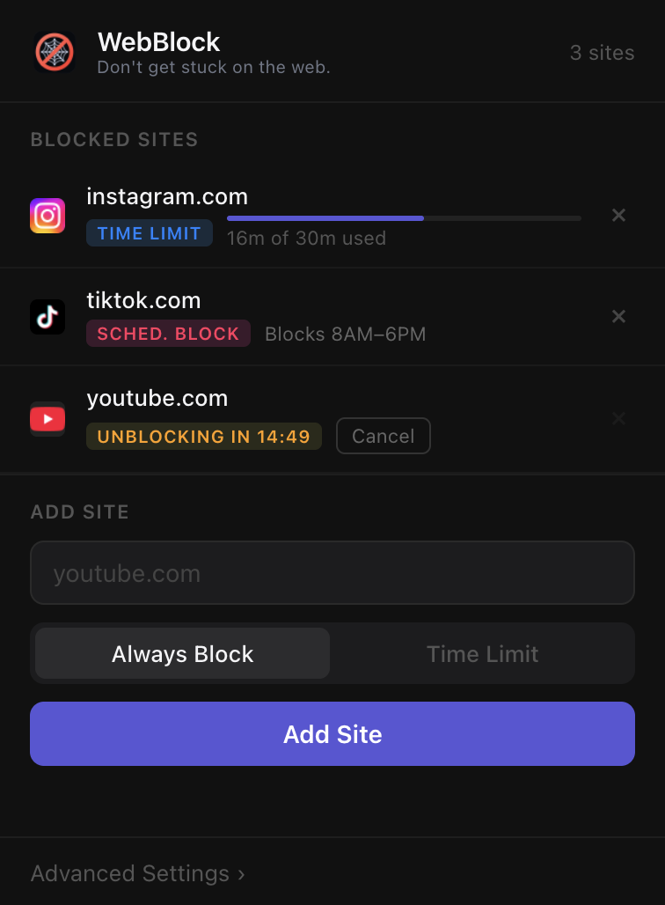

# WebBlock

Don't get stuck on the web.

WebBlock is a Chrome extension for blocking distractions with a simple, strict workflow.  
Block distracting websites, set daily time limits, schedule block windows, or use Tunnel Vision mode to block all but one website.

## Features

- Always block specific sites
- Daily time limits per site
- Scheduled block windows and scheduled allow-only windows
- Tunnel Vision: allow only one site for a fixed duration
- Delayed unblock flow with typed confirmations + cooldown
- Local-first data storage (no external backend)

## Example

### Dashboard

### Advanced settings (Tunnel Vision + schedules)

### Unblock flow — step 1 (first confirmation)

### Unblock flow — step 2 (final confirmation)

### Unblock flow — step 3 (await cooldown)

## Install (Chrome)

1. Clone this repo.
2. Open Chrome and go to `chrome://extensions`.
3. Enable **Developer mode** (top-right).
4. Click **Load unpacked**.
5. Select the project folder (`focus-guard`).

Pin the extension if you want one-click access from the toolbar.

## License

MIT
